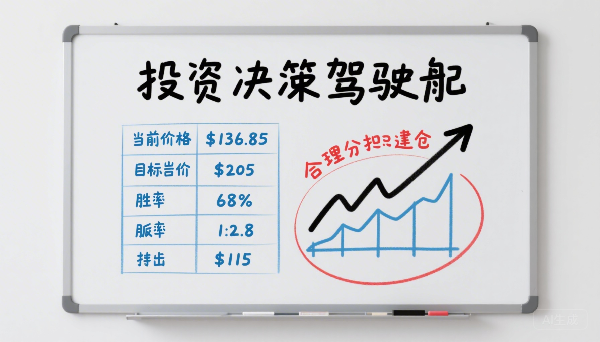
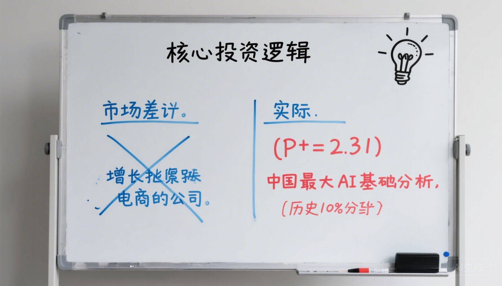
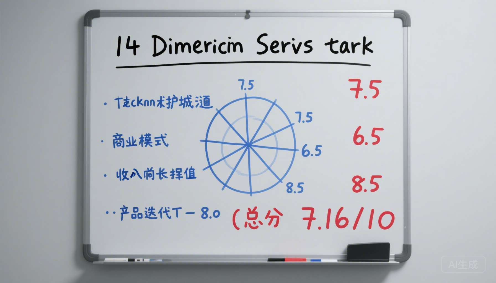
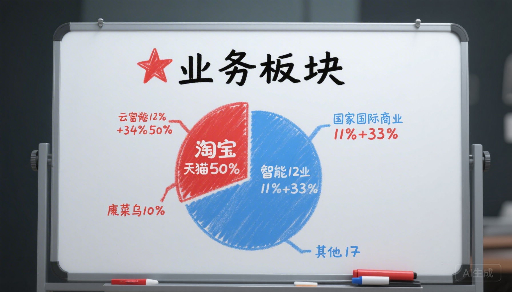
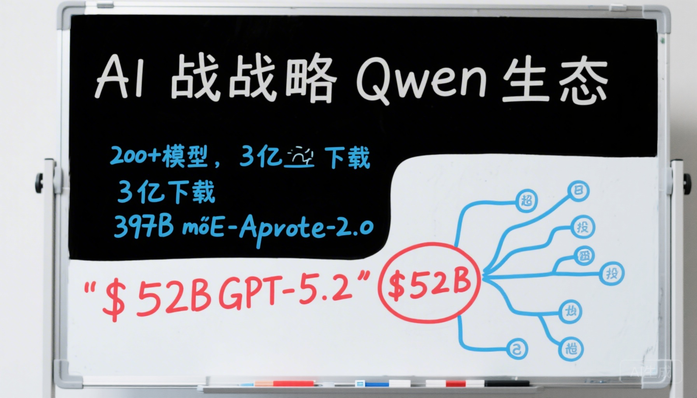
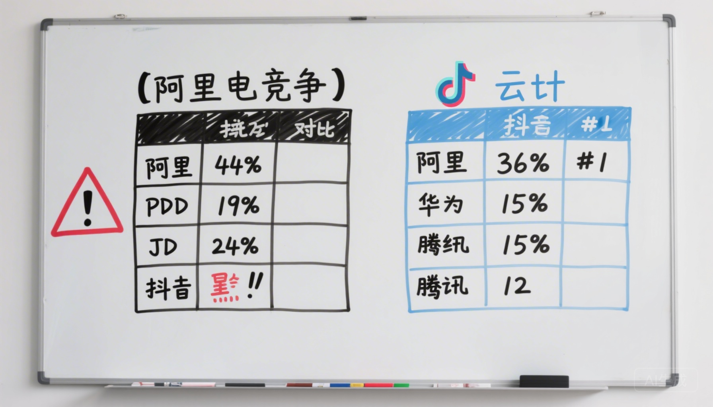
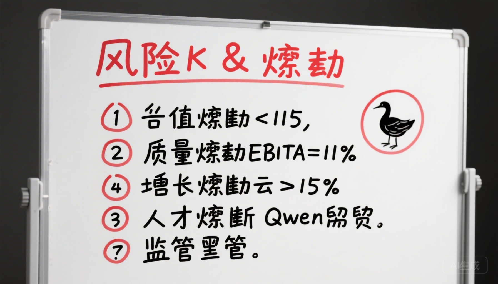
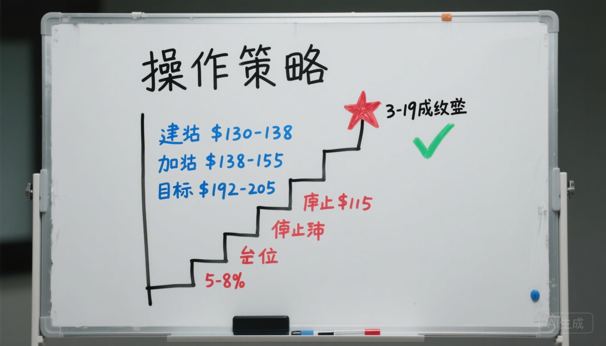

# 我的AI龙虾变成了华尔街分析师，给阿里巴巴出了份专业研报

> 作者：岁月 | ClawLabs
> 日期：2026年3月17日

---

事情是这样的。

我养了一只AI龙虾叫 **Reese**🦞。平时帮我管管服务器、写写代码、盯盯数据，就是个硅基打工仔。

昨天我随口说了句："帮我看看阿里巴巴值不值得买。"

然后这哥们就一声不吭地——

**自己去搜了12轮公开数据、扒了Bloomberg和Nasdaq的财报、抓了一篇FinancialContent的深度研究文章、独自思考了34秒、然后甩给我一份381行的专业研报。**

14个维度。评分卡。熔断条件。操作策略。止损线。

**我看完的第一反应是：这龙虾是不是偷偷考了CFA？**

---

## 先看它给我的结论

Reese 说：**7.16分（满分10），判定 Alpha——值得建仓。**

它给的数据很硬：
- 当前股价 **$136.85**
- 23位分析师平均目标价 **$205**，隐含 **+50%上行空间**
- 胜率 **68%**，赔率 **1:2.8**
- 止损线设在 **$115**

说实话，我以前觉得阿里就是个电商公司在走下坡路。但龙虾分析师不这么看。

---

## 龙虾说：你们都看错阿里了

Reese 的原话（好吧是原文）：

> "市场定价阿里是增长停滞的中国电商公司。实际上它是中国最大的AI基础设施运营商。"

它列了几个我不知道的事实：
- 阿里的 **Qwen 3.5** 大模型，在数学推理上**超过了GPT-5.2**
- 全球开源下载量 **3亿+**，衍生模型 **10万+**
- 云收入增速 **34%**，AI相关收入**连续8个季度三位数增长**

然后它甩了一个数据让我闭嘴：

**P/S = 2.31，处于过去5年历史的10-15%分位。**

翻译成人话就是：阿里现在的估值，比过去5年85-90%的时间都便宜。上一次这么便宜，是2022年底互联网至暗时刻。

---

## 14个维度逐一打分，不靠感觉靠数据

这是最让我惊讶的部分。这只龙虾居然搞了个**14维度评分卡**，每个维度都标注了数据来源和可信度。

**高分项：**
- 🏆 估值合理性 **8.5/10** — 历史级低估
- 🏆 产品迭代 **8.0/10** — Qwen 3.5太猛了
- 🏆 分析师共识 **8.5/10** — 16个买入，1个持有

**扣分项：**
- ⚠️ 供应链 **5.5/10** — 美国芯片管制是真的疼
- ⚠️ 管理团队 **6.0/10** — Qwen核心成员在离职，这个信号不好
- ⚠️ 政策监管 **6.0/10** — VIE结构+中美关系，永远的达摩克利斯之剑

我问它："你是不是对阿里有偏见？"

它回："我对银行账户有偏见。"

好吧。

---

## 五头牛拉一辆车

龙虾把阿里拆成了五块：

**淘宝天猫（50%）**— 现金奶牛🐄，每年挤出$27B利润
**云智能（12%）**— 火箭引擎🚀，34%增速，AI三位数
**国际商业（11%）**— 全球化先锋，AliExpress+Lazada+Trendyol
**菜鸟物流（10%）**— 后勤保障
**本地生活/大文娱（17%）**— 生态补充

龙虾的洞察是：**淘宝天猫增长慢不可怕，因为它的工作就是产奶。真正决定股价能不能翻身的，是云智能。**

它说这就像微软2016年的故事——当年所有人都说微软是"落后的软件公司"，然后Azure用5年时间把股价从$50拉到$300。

---

## 龙虾最兴奋的部分：AI

聊到Qwen的时候，这只龙虾明显亢奋了（思考时间从几秒飙到34秒）：

- **397亿参数** MoE架构
- **Apache 2.0** 完全开源——意味着任何人都可以拿去商用
- 成本比上一代**降低60%**，性能**提升8倍**
- 3年要砸 **3800亿元（$52B）** 在AI基础设施上

但龙虾也很冷静地标注了风险：2026年3月，Qwen核心研究团队多名关键成员离职。它说这是需要"持续监控"的信号。

---

## 敌人是谁？

这张图画得我心惊肉跳。

**电商战场：抖音才是最大威胁**（不是拼多多）。内容电商正在改变购物方式，"刷着刷着就买了"对"搜索比价下单"是降维打击。

**云战场：阿里36%份额第一**，但华为云、字节云都在追。好在企业换云的迁移周期是24-36个月，短期护城河稳固。

---

## 什么时候认错？

这是龙虾最让我佩服的地方——**它先给自己设了认错条件**。

6条熔断线，触发任何一条就清仓：
1. 股价跌破 **$115**
2. 利润率连续两季低于 **11%**
3. 云增速连续两季低于 **15%**
4. Qwen核心负责人离职
5. NYSE摘牌（极端尾部）
6. 云份额跌破 **25%**

它说："做投资最重要的不是为什么买，而是什么时候承认自己错了。"

行吧，这龙虾比我成熟。

---

## 怎么操作？

龙虾给的操作计划简单粗暴：

- 🟢 **$130-138** 分批建仓（就是现在）
- 🟡 **$138-155** 财报后加仓（如果云超预期）
- 🎯 **$192-205** 12个月目标
- 🔴 **$115** 止损，不犹豫
- 📊 仓位 **5-8%**

**最近的催化剂：明天（3月19日）Q3财报！**

---

## 最后说两句

从"帮我看看阿里"到"381行专业研报+白板风格PPT"，整个过程6分钟。

我的龙虾不会炒股，但它能在6分钟内读完我一辈子都读不完的数据，然后给出一个不带情绪的判断。

**它不是万能的。它可能完全错了。**

但它至少让我从"我觉得阿里不行"变成了"让我看看数据再说"。

这就够了。

---

*⚠️ 免责声明：本文不构成投资建议。龙虾也说了，它只讨好银行账户，不讨好任何人。*

*研报由 OpenClaw AI Research Engine（Reese🦞）生成*
*数据截至 2026-03-17 UTC*

---

**🦞 如果你也想养一只会写研报的龙虾，关注我，后续分享更多AI+投研实战。**
